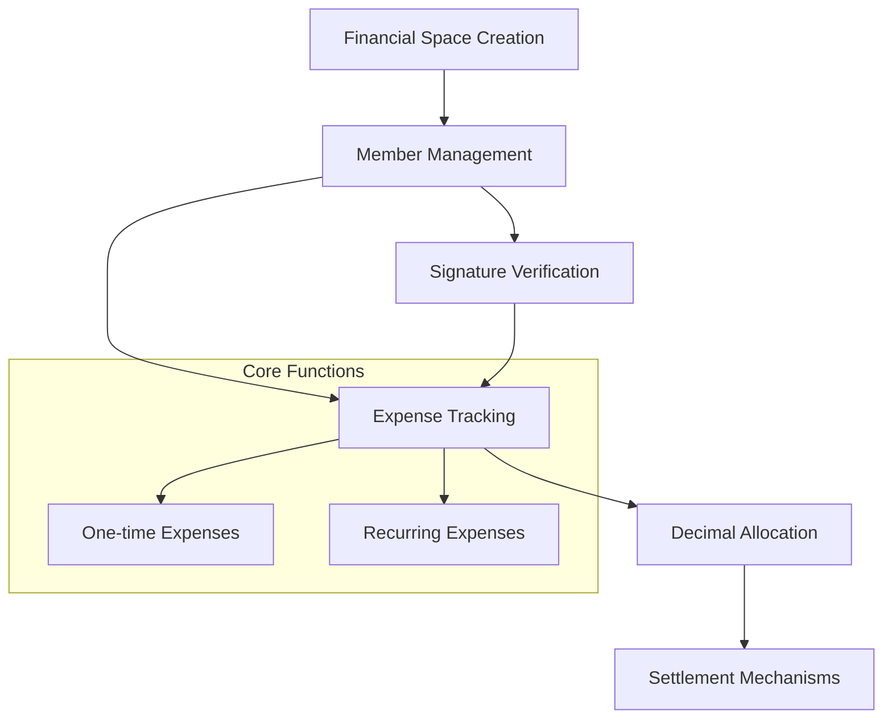

# Decimal Signature: Precision Financial Management

Decimal Signature is a decentralized Clarity-powered smart contract protocol that enables precise, transparent financial tracking and settlement using granular decimal-based allocations on the Stacks blockchain.

## Overview

Decimal Signature provides a comprehensive financial management solution that allows:
- Creating shared financial spaces
- Tracking expenses with precise decimal allocations
- Managing complex multi-party financial obligations
- Transparent settlement mechanisms
- Cryptographically secure transaction signatures

## Architecture

The system leverages a core smart contract with modular components for flexible financial management:



### Core Components:
- **Spaces**: Shared financial environments
- **Members**: Participants with defined financial roles
- **Expenses**: Flexible financial obligations
- **Allocations**: Precise decimal-based distribution
- **Signatures**: Cryptographic transaction verification

## Contract Documentation

### Decimal Signature Core Contract (`decimal-signature-core.clar`)

A robust smart contract managing sophisticated financial interactions with cryptographic integrity.

#### Key Features:
- Flexible financial space management
- Precise decimal allocation tracking
- Advanced expense categorization
- Transparent settlement protocols
- Cryptographic signature verification

#### Access Control:
- Space creators have administrative privileges
- Members can propose and verify transactions
- Signature-based authorization mechanisms

## Getting Started

### Prerequisites
- Clarinet development environment
- Stacks-compatible wallet
- Basic understanding of financial protocols

### Basic Usage

1. Create a financial space:
```clarity
(contract-call? .decimal-signature-core create-space "Project Expenses")
```

2. Add members with allocation:
```clarity
(contract-call? .decimal-signature-core add-member space-id member-address u5000)
```

3. Record an expense:
```clarity
(contract-call? .decimal-signature-core record-expense space-id "Team Lunch" u10000 "decimal")
```

## Function Reference

### Space Management

```clarity
(create-space (name (string-ascii 100)))
(add-member (space-id uint) (member principal) (allocation uint))
(update-member-allocation (space-id uint) (member principal) (allocation uint))
```

### Expense Management

```clarity
(record-expense (space-id uint) (name (string-ascii 100)) (amount uint) (allocation-type (string-ascii 10)))
(verify-expense-signature (space-id uint) (expense-id uint) (signature (buff 65)))
```

### Settlement Mechanisms

```clarity
(initiate-settlement (space-id uint) (to-member principal) (amount uint))
(complete-settlement (space-id uint) (settlement-id uint))
```

## Development

### Testing
1. Clone the repository
2. Install dependencies: `clarinet install`
3. Run comprehensive test suite: `clarinet test`

### Local Development
1. Launch local Stacks chain: `clarinet console`
2. Deploy contracts: `clarinet deploy`

## Security Considerations

### Design Principles
- Cryptographically secure transaction verification
- Granular access control
- Transparent financial tracking
- Immutable transaction records

### Architectural Safeguards
- Multi-signature verification
- Precise decimal allocation tracking
- Dynamic member management
- Comprehensive error handling

Decimal Signature provides a robust, secure framework for managing complex financial interactions with unparalleled precision and transparency.